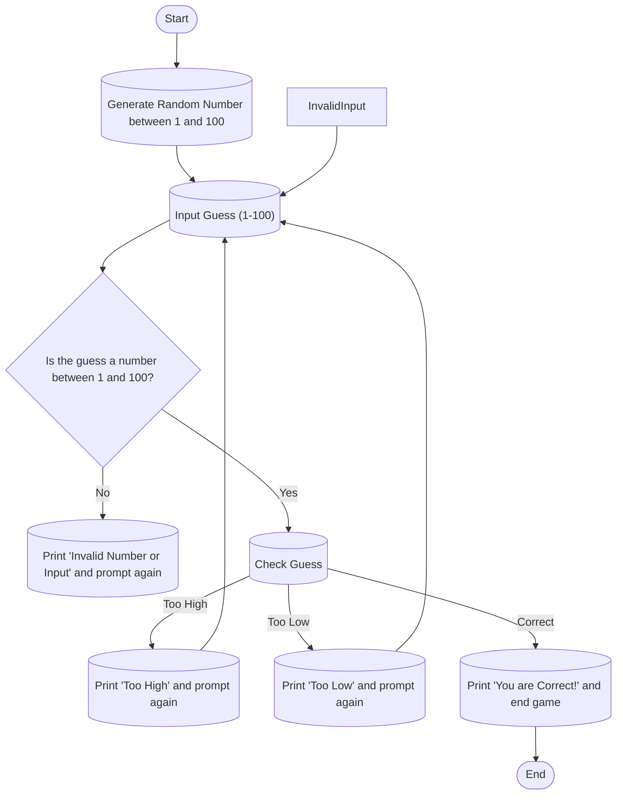

When you first start up the random number generator it will ask for you to input a guess between numbers 1-100. It will check if the number you input is within the correct range. If you insert an invalid value it will give you an error and tell you to input a proper value. If you input a proper value it will tell you if you are too high or too low from the correct number. When you input the correct guess the game will prompt you with a congrats and end the game.